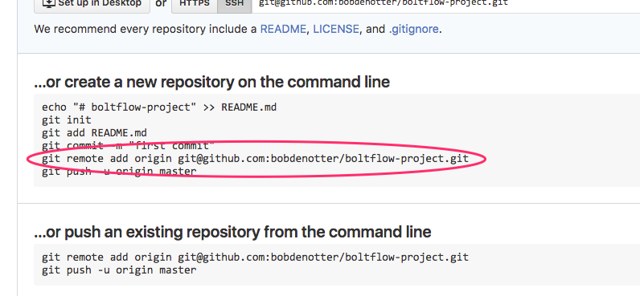

# Boltflow - Setting up a project
#bolt

The easiest way to set up a bolt project is to use the command line. Where you want to set up the site, run the following commands: 

```
curl -O https://bolt.cm/distribution/bolt-latest.tar.gz
tar -xzf bolt-latest.tar.gz --strip-components=1
php app/nut init
```

This will give you a ready-to-go install of Bolt. 


But, before we actually start developing, we need to take care of a few things:

* We should prepare a few files, and set up a `config_local.yml` with settings appropriate to our development environment. 
* We need to set up a git repository to store the site in.

# Preparing our workflow
To get started properly, we’ll use a `config_local.yml` file from the get go. This file allows us to set some slightly stricter error settings, so that it’ll be easier to spot (potential) errors. This is the exact opposite of what we’ll do on the production server, since there we want to be _lenient_ and not show any “information leaks”. 

We’ll get the boltflow bash script, that we’ll use to keep our Bolt project current. Both in regard to the latest Bolt version, as well as what’s in our git repository:

```
curl -O https://raw.githubusercontent.com/bobdenotter/bolt-boltflow-shell-script/master/boltflow.sh
chmod ugo+x ./boltflow.sh
```

Run it once, to set up our `config_local.yml` file:

```
./boltflow.sh config_local_dev
```

Run it again, to set up our extensions, cache and files folders: 

```
./boltflow.sh
```

## Setting up a .git repository
You can use any git provider you prefer, as long as you use a form of versioning control for your projects. We’re going to create a new repository, and add our project files to it, using the `.gitignore` that comes with our standard setup. 


After creating the repository, Github (or Gitlab, or Bitbucket) will provide a few helpful options to populate our new project’s repository. Instead, we’ll use what we already have for the initial commit.  Before hopping back to the command line, note the full SSH path to the repository, because we’ll need it. 



Back on the command line, set up our local install to use the git repository: 

```
git init
git add .
git commit -m "First commit"
git remote add origin {path}
git push -u origin master
```

Where `{path}` needs to be replaced with the SSH path you’ve noted above, obviously.

At this point you’ll have a working git repository, that looks like [bobdenotter/boltflow-project](https://github.com/bobdenotter/boltflow-project).


