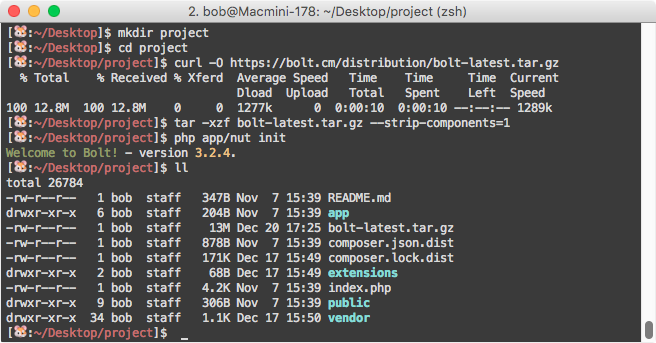
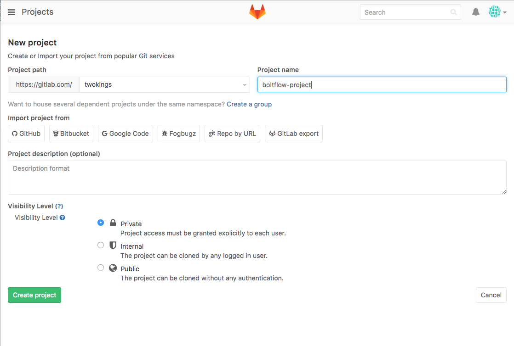
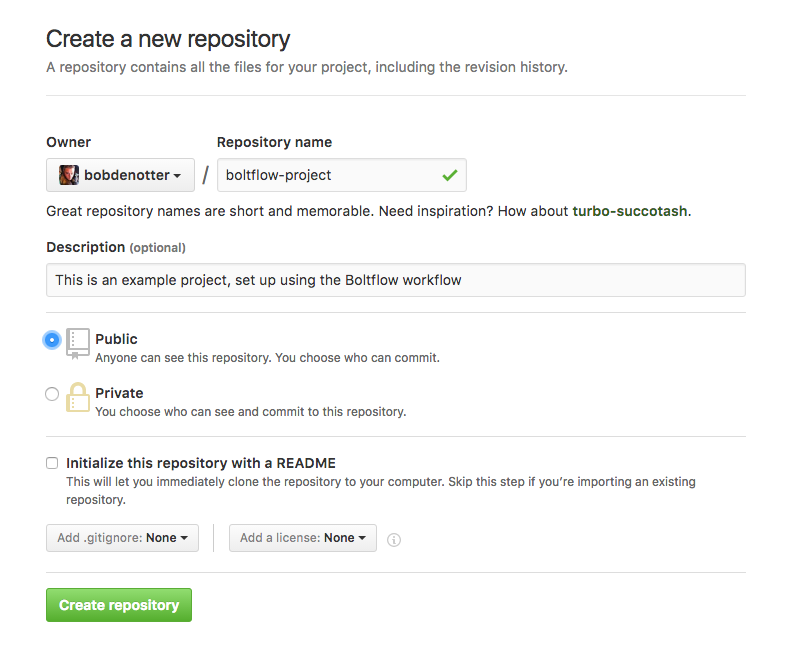
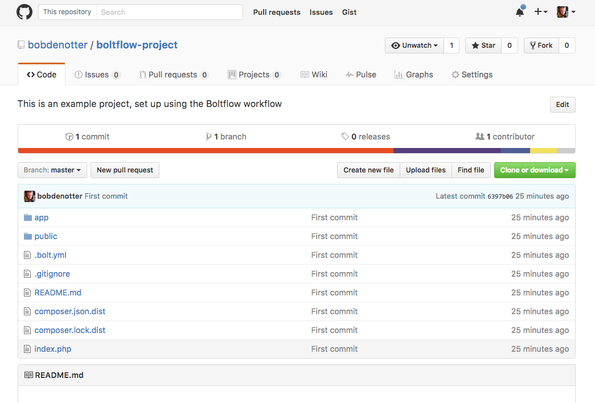

Boltflow - Setting up a project
===============================


The easiest way to set up a bolt project is to use the command line. Where you
want to set up the site, run the following commands:

```
curl -O https://bolt.cm/distribution/bolt-latest.tar.gz
tar -xzf bolt-latest.tar.gz --strip-components=1
php app/nut init
```

This will give you the foundation for your Bolt project.



Before we actually start developing, we need to take care of a few things:

 - We should prepare a few files, and set up a `config_local.yml` with settings
   appropriate to our development environment.
 - We need to set up a git repository to store the site in.

## Preparing our workflow

To get started properly, we’ll use a `config_local.yml` file from the get go.
This file allows us to set some slightly stricter error settings, so that it’ll
be easier to spot (potential) errors. This is the exact opposite of what we’ll
do on the production server, since there we want to be _lenient_ and not show
any “information leaks”.

We’ll get the boltflow shell script, that we’ll use to keep our Bolt project
current. Both in regard to the latest Bolt version, as well as what’s in our
git repository:

```
curl -O https://raw.githubusercontent.com/bobdenotter/boltflow/master/files/boltflow.sh
chmod ugo+x ./boltflow.sh
```

Run it once, to set up our `config_local.yml` file:

```
./boltflow.sh config_local_dev
```

This will create the file, and open it in an editor. You should add your
database credentials in this file, so that they will remain local to the
current environment, and they don’t get committed to the git repository we’re
about to set up.

Run boltflow.sh again, to set up our extensions, cache and files folders:

```
./boltflow.sh
```

It’s strongly recommended to store the database credentials in your
`config_local.yml` and _not_ in the general `config.yml`. If you do it like
this, you’ll be able to store most configuration in `config.yml`, and be able
to store that in your

## Setting up a git repository

You can use any git provider you prefer, as long as you use a form of
versioning control for your projects. We’re going to create a new repository,
and add our project files to it, using the `.gitignore` that comes with our
standard setup.


_(Image: Creating the project in Gitlab)_


_(Image: Creating the project in Github)_

**Note:** Be sure to set the projects visibility correct. If you’re working for
a client, you’ll probably want to set it to “private”. If you choose to keep it
“public”, verify that you’re not going to store private data or database
credentials in your repository.

After creating the repository, Github (or Gitlab, or Bitbucket) will provide a
few helpful options to populate our new project’s repository. Instead, we’ll
use what we already have for the initial commit.  Before hopping back to the
command line, note the full SSH path to the repository, because we’ll need it.


Back on the command line, set up our local install to use the git repository:

```
git init
git add .
git commit -m "First commit"
git remote add origin {path}
git push -u origin master
```

Where `{path}` needs to be replaced with the SSH path you’ve noted above, obviously.

At this point you’ll have a working git repository, that looks like
[bobdenotter/boltflow-project][].



## Updating our `.gitignore`

As you might've noticed, we just added all files to git, without scrutiny. We
were able to do this because the Bolt distibution comes with a default
[`.gitignore`][gitignore] file that's a good fit for how we choose to work.
Right now, there's only one modification to make: If you added your database
credentials to a new `config_local.yml` file, we can atually put `config.yml`
into git.

To do this, edit `.gitignore` and uncomment the following line.

## Preparing the 'web root'

To work on your project, you’ll need to configure a webserver to serve Bolt in
a browser. Most of Bolt’s files are outside of the so-called webroot, which
means that your bolt project folder (the one that contains `app/` and `vendor/`
is _not_ the folder that should be served by your webserver. The one that
should is called `public/` by default.

For more information on why this is good practice, read:
[Outside the web root][webroot].

If your webserver is configured to use another folder, there are two options
available:

### Option 1: Symlink

Create a symlink from what the server uses to the `public/` folder. For
example, something like `ln -s public html` if your webserver uses `html`
instead.

### Option 2: Rename `public/`

Rename the folder `public/` to what it should be. You’ll need to fix three
additional things in this case:

 1. Edit `.bolt.yml` to match the change.
 2. If the folder name is not `public/`, `public_html/` or `html/`, you’ll need
    to edit `boltflow.sh` to use this name:  `PUBLICFOLDER="public”`
 3. make sure you `git add` the new folder to your repository.

## Configuring the webserver

Perhaps the easiest way to get a server up and running is by using PHP’s
built-in webserver. You can start it from the command line:

```
php -S localhost:8000 -t public/
```

You’re of course free to use another webserver, like Apache or Nginx. How to
configure these is out of scope for this document. You probably already have a
webserver running, so I’d advise to keep running that. If you don’t have a
webserver running on your local development machine, look into [WAMP][],
[MAMP][] or [XAMPP][].

[gitignore]: https://github.com/bolt/bolt-distribution/blob/master/extras/.gitignore
[bobdenotter/boltflow-project]: https://github.com/bobdenotter/boltflow-project
[WAMP]: http://www.ampps.com/
[MAMP]: https://www.mamp.info/en/
[XAMPP]: https://www.apachefriends.org/index.html
[webroot]: https://docs.bolt.cm/3.2/howto/troubleshooting-outside-webroot#what-s-the-point-of-doing-this